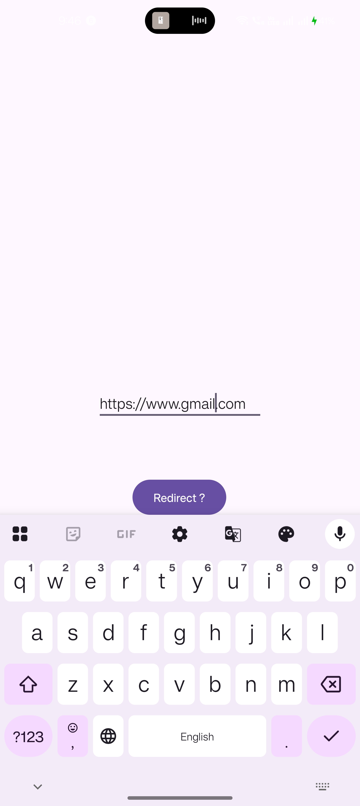
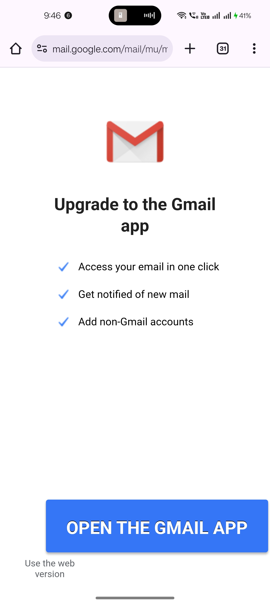

# Ex.No:2a Develop program to create a text field and a button “Navigate”. When you enter “www.gmail.com” and press navigate button it should open google page using Implicit Intents.


## AIM:

To create a navigate button using Implicit Intent to display the gmail page using Android Studio.

## EQUIPMENTS REQUIRED:

Latest Version Android Studio

## ALGORITHM:


## PROGRAM:

```
/*
Program to print the text “Implicitintent”.
Developed by:
Registeration Number :
*/
package com.example.intent;

import android.content.Intent;
import android.net.Uri;
import android.os.Bundle;
import android.view.View;
import android.widget.Button;
import android.widget.EditText;


import androidx.appcompat.app.AppCompatActivity;

public class MainActivity extends AppCompatActivity {

    @Override
    protected void onCreate(Bundle savedInstanceState) {
        EditText editText;
        Button button;

        super.onCreate(savedInstanceState);
        setContentView(R.layout.activity_main);

        editText = findViewById(R.id.editTextText);
        button = findViewById(R.id.button);

        button.setOnClickListener(new View.OnClickListener() {
            @Override
            public void onClick(View view) {
                String url = editText.getText().toString();
                Intent intent = new Intent(Intent.ACTION_VIEW, Uri.parse(url));
                startActivity(intent);
            }
        });

    }
}
```

## OUTPUT
Design Part : 


Coding part :


App : 



Gmail : 



## RESULT
Thus a Simple Android Application create a navigate button using Implicit Intent to display the gmail page using Android Studio is developed and executed successfully.


